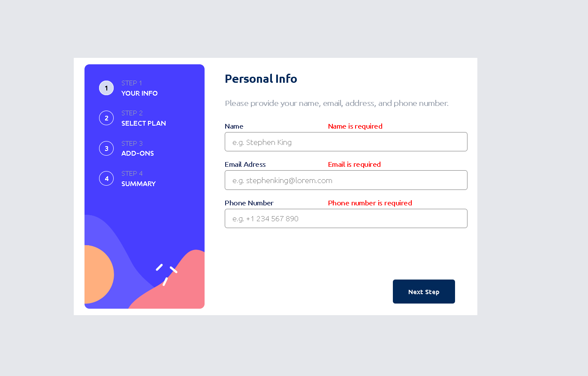

# Frontend Mentor - Multi-step form solution

This is a solution to the [Multi-step form challenge on Frontend Mentor](https://www.frontendmentor.io/challenges/multistep-form-YVAnSdqQBJ). Frontend Mentor challenges help you improve your coding skills by building realistic projects. 

## Overview

### The challenge

Users should be able to:

- Complete each step of the sequence
- Go back to a previous step to update their selections
- See a summary of their selections on the final step and confirm their order
- View the optimal layout for the interface depending on their device's screen size
- See hover and focus states for all interactive elements on the page
- Receive form validation messages if:
  - A field has been missed
  - The email address is not formatted correctly
  - A step is submitted, but no selection has been made

### Screenshot

### Links

- Challenge page: [link](https://www.frontendmentor.io/challenges/multistep-form-YVAnSdqQBJ)
- Live Site: [link](https://marioa96.github.io/09-FEM_multiStepForm/)

## My process

### Built with

- Semantic HTML5 markup
- CSS custom properties
- Flexbox
- CSS Grid
- Mobile-first workflow
- [Svelte](https://svelte.dev/docs/introduction) - JS library
- [Astro](https://docs.astro.build/en/getting-started/) - Web framework
- [PandaCSS](https://panda-css.com/docs/overview/getting-started) - For styles

## Author

- Website - WIP-Website
- Frontend Mentor - [@MarioA96](https://www.frontendmentor.io/profile/MarioA96)
- Twitter - [@FewLines500](https://x.com/FewLines500)

## Continued development

### What's next (TODO list):

-   ✔️: Agregar la validacion de campos del formulario de la primera card al opimir NextStep
-   ✔️: Arreglar el bug del switch que cuando uno pasa de una card a otra se pierde el estado
-   ✔️: Hacer que cuando se oprima el boton en la segunda card esta permanezca en el mismo estado
-   ✔️: Hacer que los datos de la segunda card permanezca de acuerdo al estado del store
-   ✔️: Hacer que la 4ta card se muestre de acuerdo a los datos del store
-   ✔️: Hacer la version desktop de la aplicacion completa
-   ❌: Las validaciones de cada carta deben ocurrir cada que se de en Next
-   ✔️: Al oprimir el boton de confirmar de la 4ta card se debe de mostrar un mensaje de confirmacion
-   ❌: Simplificar la 4ta card mediante custom hooks
-   ❌: Agregar la validacion al boton de confirmar de la 4ta card, que este PersonalInfo.isValid en true
-   ✔️: Arreglar bug de los campos de la carta 1 al tener con error un campo, los demas siguen marcados como